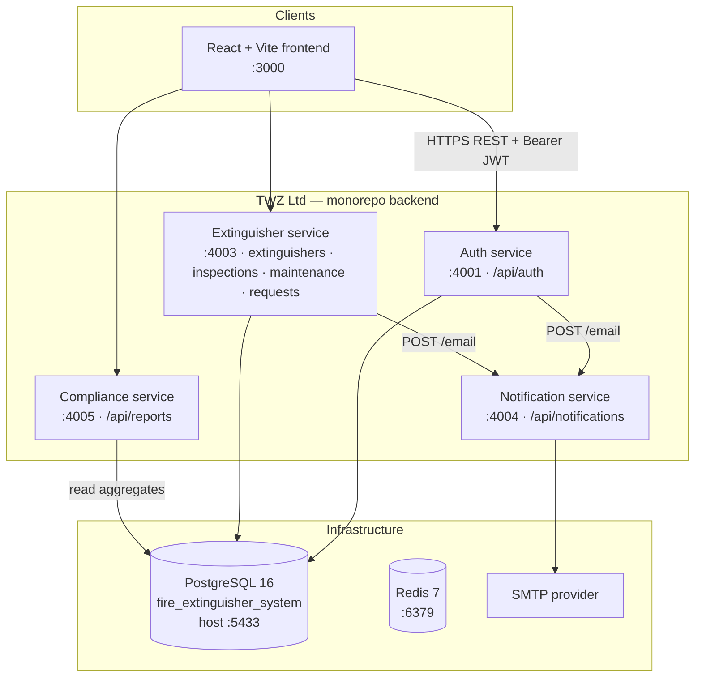
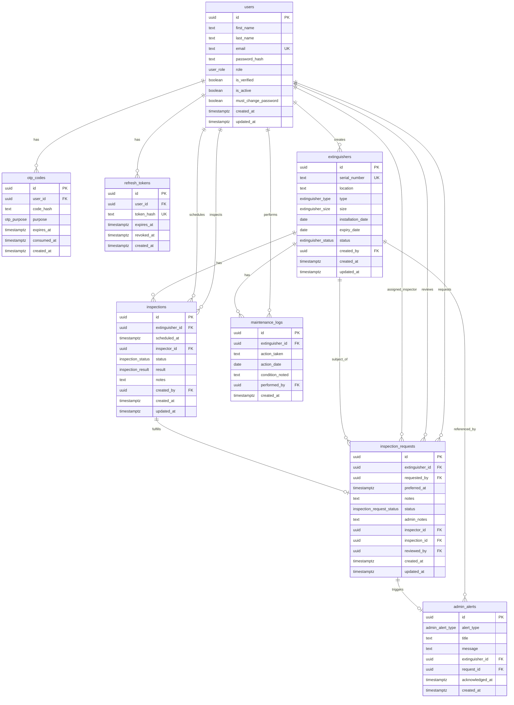
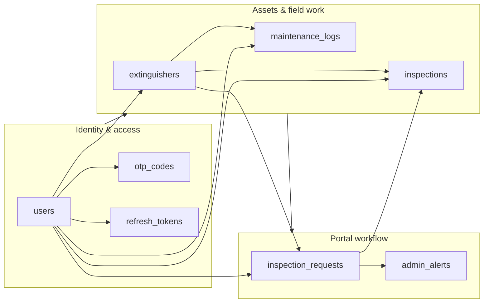
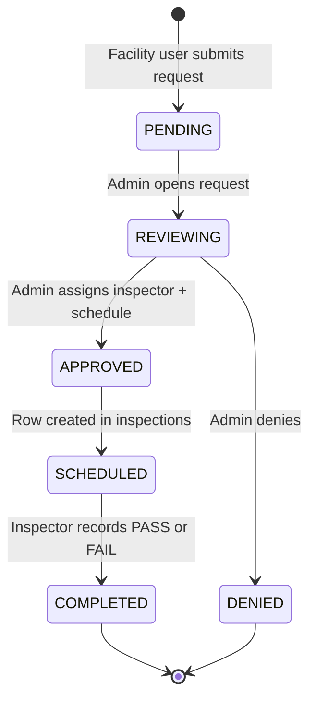
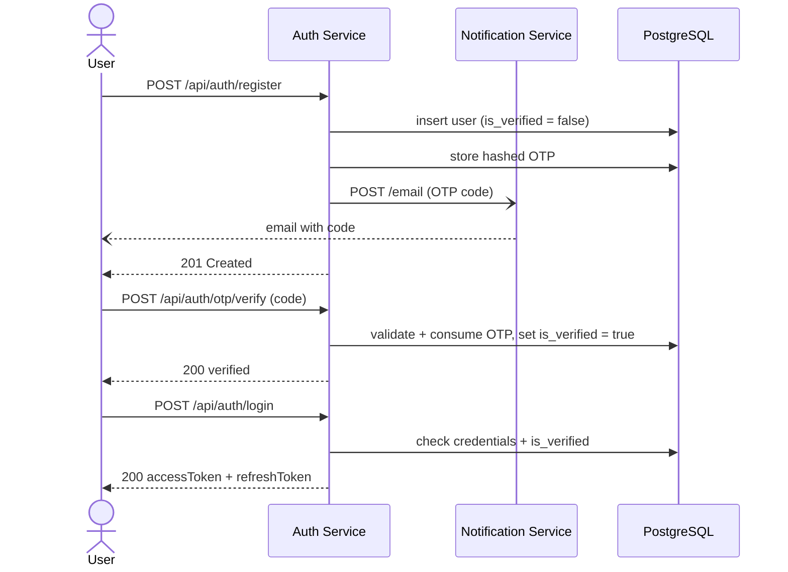
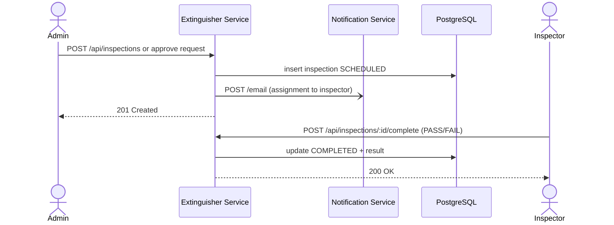
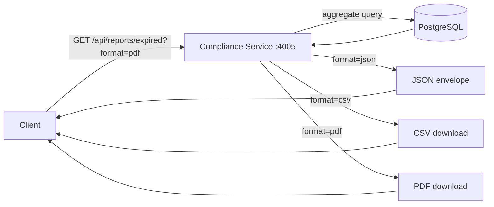

# Fire Extinguisher Lifecycle Management System

A production-ready Node.js monorepo for managing fire extinguisher lifecycle, compliance, and maintenance operations.

## Project Structure

```
fire-extinguisher-pract-tplt/
├── apps/
│   ├── backend/
│   │   ├── auth-service/              # Authentication & User Management (Port 4001)
│   │   ├── extinguisher-service/      # Extinguishers, Inspections, Maintenance (Port 4003)
│   │   ├── notification-service/      # Email gateway / OTP & notices (Port 4004)
│   │   └── compliance-service/        # Reports & PDF/CSV export (Port 4005)
│   └── frontend/                       # React + Vite Frontend (Port 3000)
├── packages/
│   ├── shared-types/                  # Shared TypeScript Types
│   ├── shared-constants/              # Shared Constants
│   ├── shared-utils/                  # Shared Utility Functions
│   └── db-migrations/                 # Database Migrations
├── docker-compose.yml                 # PostgreSQL & Redis
├── package.json                       # Root Configuration
├── pnpm-workspace.yaml               # Workspace Configuration
└── tsconfig.json                      # Base TypeScript Configuration
```

## Quick Start

### Prerequisites

- Node.js >= 18.0.0
- pnpm >= 8.0.0
- Docker & Docker Compose

### Installation

```bash
# Install dependencies
pnpm install

# Copy environment configuration
cp .env.example .env
```

### Development

```bash
# Start all services and frontend
pnpm run dev

# Or run services only
pnpm run dev:services

# Or run frontend only
pnpm run dev:frontend
```

### Database Setup

```bash
# Start PostgreSQL and Redis containers
pnpm run db:up

# Run migrations + seed default admin
pnpm run db:migrate
pnpm run db:seed
```

Default admin (after seed):

| Email | Password | Role |
|-------|----------|------|
| agressive.one04@gmail.com | Rodin!132 | ADMIN |

### Build

```bash
# Build all packages and services
pnpm run build
```

### Testing

```bash
# Run all tests (unit + integration)
pnpm run test
```

**Unit tests** (`shared-utils`) run with no external dependencies.

**API integration tests** live in one place: `packages/api-tests/` (Supertest against every service’s Express app). They require PostgreSQL on the test database `fire_extinguisher_test`:

```bash
pnpm run db:up
docker exec fire-extinguisher-db createdb -U admin fire_extinguisher_test   # one-time
pnpm test   # shared-utils unit tests + all endpoint tests
```

Tests apply migrations automatically and truncate tables between cases.

### Linting

```bash
# Lint all packages
pnpm run lint
```

## Services Overview

Every service shares one PostgreSQL database (`fire_extinguisher_system`) and the
same layered structure (`config → db → repository → service → routes`) with shared
middleware (JWT auth + RBAC, Zod validation, Helmet, rate limiting, request logging,
centralized errors) from `@fire-system/shared-utils`. Each service exposes interactive
**Unified API docs:** [http://localhost:4010/docs](http://localhost:4010/docs) — all endpoints in one Swagger UI. Use the **Servers** dropdown (top right) to switch between Auth **4001**, Extinguisher **4003**, Notification **4004**, and Compliance **4005**. Per-service docs: `/docs` on each port.

**Roles:** `ADMIN` (manages users & data integrity), `INSPECTOR` (conducts inspections,
logs results & maintenance), `USER` (views status, schedules inspections).

### Auth Service (Port 4001) — `/api/auth` · docs at `/docs`

Registration sends an **email-verification OTP**; the account cannot log in until the
email is verified. Access tokens are short-lived JWTs; refresh tokens are opaque,
hashed at rest, and rotated on every refresh.

| Method | Path                | Auth   | Role | Description                                  |
|--------|---------------------|--------|------|----------------------------------------------|
| POST   | `/register`         | —      | —    | Register (firstName, lastName, email, password) → sends OTP |
| POST   | `/login`            | —      | —    | Authenticate (requires verified email)       |
| POST   | `/refresh`          | —      | —    | Rotate refresh token → new token pair         |
| POST   | `/logout`           | —      | —    | Revoke a refresh token                        |
| POST   | `/otp/request`      | —      | —    | Request an OTP (EMAIL_VERIFICATION / PASSWORD_RESET) |
| POST   | `/otp/verify`       | —      | —    | Verify an OTP (verifies email)                |
| POST   | `/password/reset`   | —      | —    | Reset password using a PASSWORD_RESET OTP     |
| GET    | `/me`               | Bearer | any  | Current user profile                          |
| PATCH  | `/me`               | Bearer | any  | Update profile (firstName / lastName)         |
| POST   | `/password/change`  | Bearer | any  | Change password (knows current one)           |
| GET    | `/users`              | Bearer | ADMIN | List users (paginated, `?role=` filter)      |
| POST   | `/users`              | Bearer | ADMIN | Create inspector or facility manager         |
| PATCH  | `/users/:id`          | Bearer | ADMIN | Update user role / active status             |

> OTP codes are **only sent by email** — they are never returned in API responses or shown in the UI.

### Extinguisher Service (Port 4003) — docs at `/docs` · all routes require a Bearer token

| Method | Path                          | Role               | Description                          |
|--------|-------------------------------|--------------------|--------------------------------------|
| POST   | `/api/extinguishers`          | ADMIN              | Register an extinguisher             |
| GET    | `/api/extinguishers`          | any                | List (paginated; `status/type/search` filters) |
| GET    | `/api/extinguishers/:id`      | any                | View by id                           |
| PUT    | `/api/extinguishers/:id`      | ADMIN, INSPECTOR   | Update info                          |
| DELETE | `/api/extinguishers/:id`      | ADMIN              | Remove record                        |
| POST   | `/api/inspections`            | any                | Schedule inspection (notifies inspector) |
| GET    | `/api/inspections`            | any                | List inspections (paginated)         |
| POST   | `/api/inspections/:id/complete` | ADMIN, INSPECTOR | Log inspection result (PASS/FAIL)    |
| POST   | `/api/inspections/:id/cancel` | ADMIN, INSPECTOR   | Cancel inspection                    |
| POST   | `/api/maintenance`            | ADMIN, INSPECTOR   | Log maintenance activity             |
| GET    | `/api/maintenance`            | any                | Maintenance history (paginated)      |

### Notification Service (Port 4004) — `/api/notifications`

Internal email gateway used by the other services. `POST /email { to, subject, body }`
sends via SMTP (from `.env`); if SMTP isn't configured the message is logged instead,
so OTP and inspection flows still work in development.

### Compliance / Reporting Service (Port 4005) — `/api/reports` · docs at `/docs`

All report endpoints accept `?format=json|csv|pdf` (CSV/PDF stream as downloads). Any
authenticated user can read and download reports.

| Method | Path                      | Description                                        |
|--------|---------------------------|----------------------------------------------------|
| GET    | `/api/reports/summary`    | Totals: extinguishers, by status/type, expired, inspections |
| GET    | `/api/reports/stock`      | Stock intake by `?period=daily\|monthly\|yearly`    |
| GET    | `/api/reports/inspections`| Inspection status breakdown                        |
| GET    | `/api/reports/expired`    | Expired extinguishers (paginated JSON / full CSV-PDF) |
| GET    | `/api/reports/maintenance`| Maintenance history (paginated JSON / full CSV-PDF) |


## Shared Packages

- **shared-types**: Common TypeScript interfaces and types (User, roles, DTOs, API envelope)
- **shared-constants**: Application-wide constants (HTTP status, error codes, auth tunables)
- **shared-utils**: Reusable utilities (bcrypt hashing, JWT, OTP/token helpers, logger, errors)
- **db-migrations**: Forward-only SQL migration runner (`V*__*.sql` files, tracked in `schema_migrations`)

> The migration runner is a small Node/`pg` script (`pnpm run db:migrate`) — it
> applies each pending `V*.sql` file in a transaction and records it, so it is
> safe to re-run.

## Environment Configuration

See `.env.example` for all available configuration options:

```env
DB_HOST=localhost
DB_PORT=5432
DB_USER=admin
DB_PASSWORD=admin123
DB_NAME=fire_extinguisher_system
JWT_SECRET=your-secret-key-here
NODE_ENV=development
```

## Docker Services

The `docker-compose.yml` includes:

- **PostgreSQL 16** - Primary database
- **Redis 7** - Caching and session management

```bash
# Start containers
docker-compose up -d

# Stop containers
docker-compose down

# View logs
docker-compose logs -f
```

## Scripts

| Command | Description |
|---------|-------------|
| `pnpm run dev` | Start all services and frontend |
| `pnpm run dev:services` | Start all backend services |
| `pnpm run dev:frontend` | Start frontend only |
| `pnpm run build` | Build all packages |
| `pnpm run test` | Unit tests + all API endpoint tests (`packages/api-tests`) |
| `pnpm --filter @fire-system/api-docs-service dev` | Unified Swagger UI on port **4010** |
| `pnpm run lint` | Lint all packages |
| `pnpm run db:migrate` | Run database migrations |
| `pnpm run db:seed` | Seed default admin user |
| `pnpm run db:up` | Start Docker containers |

## Health Checks

Each service exposes a health check endpoint:

```bash
curl http://localhost:4001/health    # Auth Service
curl http://localhost:4003/health    # Extinguisher Service
curl http://localhost:4004/health    # Notification Service
curl http://localhost:4005/health    # Compliance Service
```

**API documentation (single URL):** http://localhost:4010/docs — switch Auth / Extinguisher / Notification / Compliance from the dropdown.  
Individual services: http://localhost:4001/docs · :4003/docs · :4004/docs · :4005/docs

## Architecture & diagrams

All diagrams below use [Mermaid](https://mermaid.js.org). They render on GitHub, in VS Code/Cursor Markdown preview (with a Mermaid extension), or at [mermaid.live](https://mermaid.live) for PNG/SVG export.

### Viewing & exporting diagrams

Install from the Extensions panel (`Ctrl+Shift+X`):

| Extension | ID | Purpose |
|-----------|-----|---------|
| **Markdown Preview Mermaid Support** | `bierner.markdown-mermaid` | Render Mermaid in this README preview |
| **Markdown All in One** (optional) | `yzhang.markdown-all-in-one` | TOC, shortcuts |
| **Draw.io Integration** (optional) | `hediet.vscode-drawio` | Edit `.drawio` files in the editor |

1. Open this `README.md` → `Ctrl+Shift+V` (**Markdown: Open Preview**).
2. Or copy any `mermaid` block to [mermaid.live](https://mermaid.live) and export.

**draw.io ER diagram (submission export):** paste `docs/db-schema.sql` into [diagrams.net](https://app.diagrams.net) → **Arrange → Insert → Advanced → SQL** → **Insert** → **File → Export as** PNG/PDF/SVG. Keep that SQL file aligned with `packages/db-migrations/migrations/` when the schema changes.

### System deployment



- **JWT is shared** — auth signs tokens; other services verify with the same `JWT_SECRET`.
- **Notifications are best-effort** — email failure does not block the main API response.
- **Single database** — all services use `fire_extinguisher_system` as the source of truth.

### Database entity relationship diagram



### Core data flow



### Inspection request lifecycle



Facility **USER** accounts see pass/fail outcomes only on **their own** requests via `/api/inspection-requests` (not the inspections API).

### Registration & email verification



### Inspection scheduling & completion



### Reporting export



## End-to-End Flow

```bash
pnpm install
cp .env.example .env          # then fill in JWT_SECRET (+ SMTP if you want real email)
pnpm run db:up                # start PostgreSQL
pnpm run db:migrate           # create the schema
pnpm run dev:services         # start all backend services (ports 4001–4005)
```

Then the typical journey:

1. `POST /api/auth/register` → check email for OTP.
2. `POST /api/auth/otp/verify` with the code from email (`purpose: EMAIL_VERIFICATION`).
3. `POST /api/auth/login` → returns `accessToken`.
4. Call the extinguisher/compliance APIs with `Authorization: Bearer <accessToken>`.
5. Download a report: `GET /api/reports/expired?format=pdf` (or `csv`).

> Run `pnpm run db:seed` for the default ADMIN account, or use **Users** in the app (admin only) to add inspectors and facility managers.

**Database export** (with Docker Postgres on host port 5433):

```bash
docker exec fire-extinguisher-db pg_dump -U admin -d fire_extinguisher_system -F c -f /tmp/backup.dump
docker cp fire-extinguisher-db:/tmp/backup.dump ./fire_extinguisher_system.dump
```

## Technology Stack

- **Runtime**: Node.js 18+
- **Package Manager**: pnpm
- **Language**: TypeScript
- **Backend**: Express.js
- **Frontend**: React 18 + Vite
- **Database**: PostgreSQL 16
- **Cache**: Redis 7
- **Validation**: Zod
- **Logging**: Winston
- **State Management**: Redux Toolkit

## Contributing

1. Create a feature branch: `git checkout -b feature/xyz`
2. Make changes and commit: `git commit -am 'Add feature'`
3. Push to branch: `git push origin feature/xyz`
4. Create a pull request

## License

MIT

## Support

For issues and questions, please open an issue on the repository.
